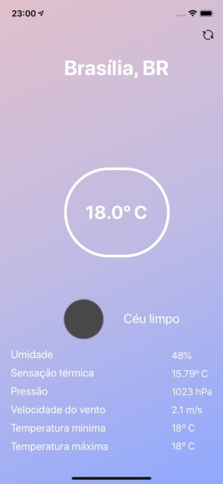

# Weather App


This project is an app made with React Native to show weather info based on GPS position.



## Run the app 

Make sure you have React Native development [environment](https://reactnative.dev/docs/environment-setup) set

Install the packages:

```sh 
yarn
```

Run the app:

```sh
react-native run-ios or
react-native run-android
```
